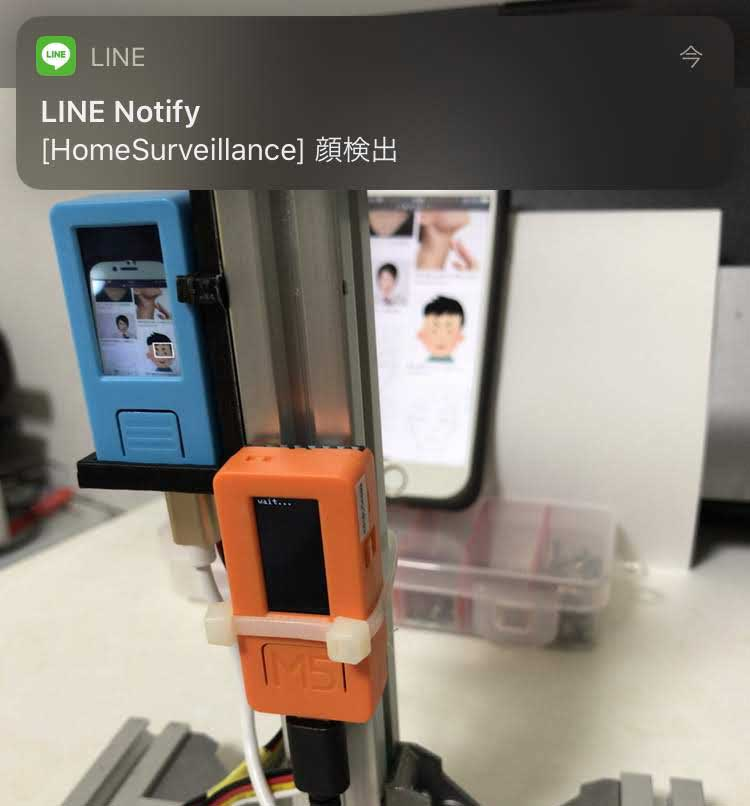

# M5StickV,M5StckCで作る簡易監視装置
# SimpleHomeSurveillanceWithM5StickCV

Simple home surveillance system using M5StickV and M5StickC. Recognize faces using M5SticV.
A recognized face image is sent to smartphones from M5StickC via the line notify service.

# presentation

M5StickC M5StickVを使った簡易監視装置を作ってみる

https://www.slideshare.net/tomit3/m5stickc-m5stickv
